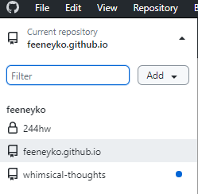
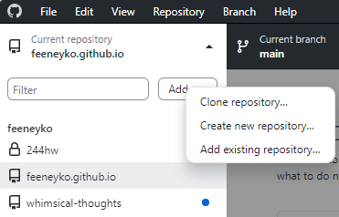

## 1 参考这篇文章
[如何用 GitHub Pages + Hugo 搭建个人博客 by 小绵尾巴](https://cuttontail.blog/blog/create-a-wesite-using-github-pages-and-hugo)

两点没有提到的：

1. 在第六步安装和配置主题时，可能需要按需修改 `.toml` 文件的名字，否则可能无法预览

2. 根据 `exampleSite` 内的 content 来修改`archetypes` 文件内的内容；防止以后创建文章 `.md` 内自动生成的文章信息错误


## 2 如果在第九步设置SSH时卡住了
可以尝试以下步骤。

1. 确保 GitHub Pages 仓库的名字是 [username].github.io


2. 一直按照上面的教程做完第 6.4 步，输完下面的命令
    ```
    git remote add origin [...]
    ```

3. 进入 `~\public\.git`，修改config文件，在原本填的`SSH` 的位置放入 `HTTPS`
    
    

4. 下载安装 GitHub Desktop。图形界面很简单，乱点一通或者随便搜下就能设置好。

5. 点击左上角工具栏下方的第一个大按钮，选择 `Add existing ...`
    
    

6. 添加之前准备好的 `public` 文件夹。GitHub Desktop 建议你按的按钮应该会有很显眼的提示。一顿瞎按，转到 GitHub 查看 GitHub Pages 仓库中是否存在刚刚推送的文件，存在则代表推送成功。以后每次写完只要打开 GitHub Desktop 一顿瞎按就好。

## 3 （可选）设置自定义域名
[Github pages使用自定义域名 by 余小梦](https://zhuanlan.zhihu.com/p/529826545)

## 4 其他
1. 页面可能不显示修改后内容，可以开隐身模式查看
2. 图片显示不出来：可以修改 `content` 内文件目录，查看 `public` 文件夹根据 `content` 所生成的内容，同时在网页上查看图片所引用(view page source)的位置，最后在 `.md` 内调整图片引用或者在 `content` 调整图片位置。
3. TODO: 翻译功能，修改字体（大概率都不会实现）
